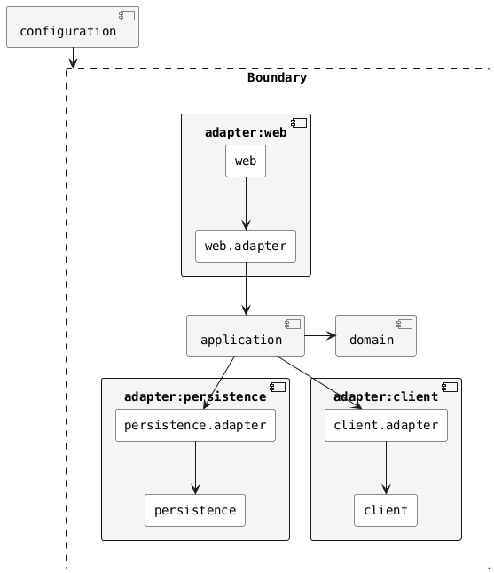

# HoCATLing 🐾

HoCATLing，Hands-on Clean Architecture Template Ling，即可落地的整洁架构模板轻量级版本，基于[HoCAT](https://github.com/macdao/hands-on-clean-architecture-template)，适用于小型项目。

- 不拆分多个独立的组件，简化项目结构
- 刻意不使用DIP，而是直接依赖实现，简化依赖关系

## 项目说明

查看文档[EXPLANATION.md](docs/EXPLANATION.md)。

## 项目使用

- 前置条件
    - 安装Java 21。
    - 安装Docker和Docker Compose。

- 测试构建

  使用`./gradlew build`构建项目。

- 本地运行

  使用`./gradlew bootRun`运行本地环境。

  如果需要启动本地三方服务，运行`scripts/run-stub-runner-server src/test/resources/contracts/client 16581`

- 打包

  使用`./gradlew bootBuildImage`构建Docker镜像。这基于Spring Boot的Gradle插件。

## 其他说明

查看[HoCAT README](https://github.com/macdao/hands-on-clean-architecture-template/blob/main/README.md)